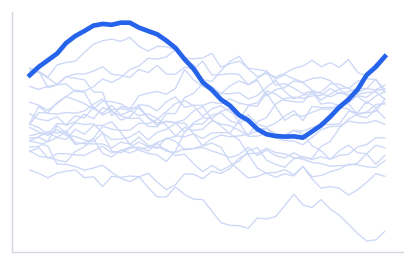
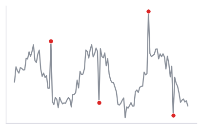
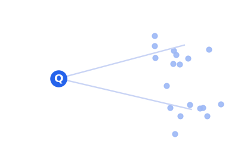

<!-- ============================================================= -->
<!-- DARK HERO — the one visual departure on the site. Full-bleed, -->
<!-- animated on load. Everything below reverts to the light theme. -->
<!-- Swap assets/hero-photo.jpg for the real portrait.              -->
<!-- ============================================================= -->

```{=html}
<section class="dark-hero">
  <div class="dark-hero-text">
    <p class="dark-hero-eyebrow">Data Scientist &amp; AI Engineer</p>
    <h1 class="dark-hero-name">Ashish Surve</h1>
    <p class="dark-hero-tagline">
      I build and ship production ML systems — forecasting, anomaly detection,
      and fraud detection at scale — for CPG, retail, and enterprise clients.
    </p>
    <div class="dark-hero-cta">
      <a class="primary" href="projects/index.html">View projects</a>
      <a class="secondary" href="resume.pdf">Résumé (PDF)</a>
      <a class="secondary" href="mailto:surve.ashish@outlook.com">Get in touch</a>
    </div>
  </div>
  <div class="dark-hero-photo-wrap">
    
  </div>
  <div class="dark-hero-scroll-cue"><span class="dot"></span> Scroll</div>
</section>
```

<!-- ============================================================= -->
<!-- PROJECT CARDS — ~70% of the page. Three, best first.          -->
<!-- Each card: thumbnail, one-line RESULT, one-line context.       -->
<!-- ============================================================= -->

::: {.reveal}
```{=html}
<div class="project-cards">
  <a class="project-card" href="projects/trade-promotion-forecasting/index.html">
    
    <div class="pc-body">
      <p class="pc-result">Trained 300,000+ forecasting models to deliver $2.4M in client savings</p>
      <p class="pc-sub">CPG trade-promotion optimization · 100M+ rows/day</p>
    </div>
  </a>
  <a class="project-card" href="projects/timeseries-anomaly-detection/index.html">
    
    <div class="pc-body">
      <p class="pc-result">Cut anomaly-detection false positives by 35%</p>
      <p class="pc-sub">Multivariate time series · PyOD / deep models</p>
    </div>
  </a>
  <a class="project-card" href="projects/rag-nl2sql/index.html">
    
    <div class="pc-body">
      <p class="pc-result">Built a RAG marketing assistant — 2nd place in an internal hackathon</p>
      <p class="pc-sub">LLM agent · retrieval + structured-data Q&amp;A</p>
    </div>
  </a>
</div>
```
:::

<!-- ============================================================= -->
<!-- 3-LINE BIO + PHOTO                                             -->
<!-- ============================================================= -->

::: {.reveal}
::: {.bio-row}
{alt="Ashish Surve"}

<div>
Product-focused data scientist with 6+ years shipping ML systems across CPG, retail, and real estate.
Currently a Senior Data Scientist (Team Lead) at Globant, leading a payroll fraud detection platform for a Big 4 client. Previously at Tiger Analytics, where I trained 300k+ forecasting models and shipped anomaly detection and RAG systems.
I own problems end to end, from framing and distributed feature engineering to deployment and monitoring.
</div>
:::
:::

<!-- ============================================================= -->
<!-- CONTACT LINKS                                                  -->
<!-- ============================================================= -->

::: {.reveal}
::: {.contact-links}
[GitHub](https://github.com/Ashish-Surve) ·
[LinkedIn](https://www.linkedin.com/in/ashish-surve) ·
[Email](mailto:surve.ashish@outlook.com) ·
[Résumé (PDF)](resume.pdf)
:::
:::

<!-- OPTIONAL: latest 3 posts, small, at the very bottom.          -->
<!-- Uncomment once /blog is live (3 posts).                        -->

<!--
::: {.latest-posts}
## Latest writing
- [Forecasting at 300k models: what breaks at scale](blog/forecasting-at-scale/index.html)
- [Cutting anomaly false positives without missing the real ones](blog/anomaly-false-positives/index.html)
- [What it actually takes to put RAG in production](blog/rag-in-production/index.html)
:::
-->
