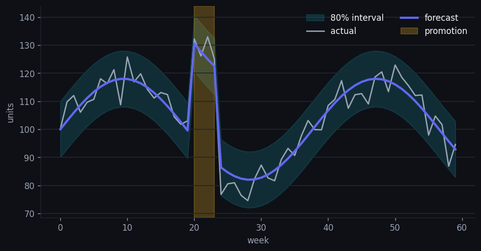
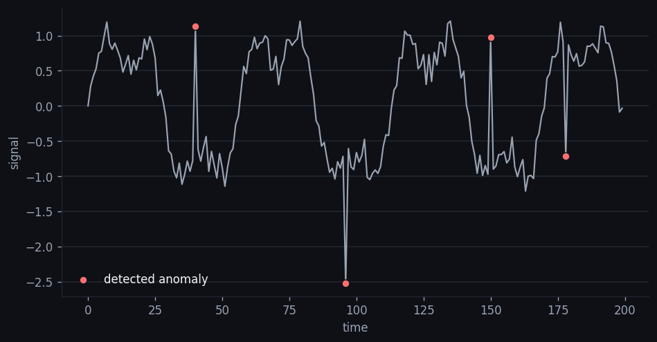
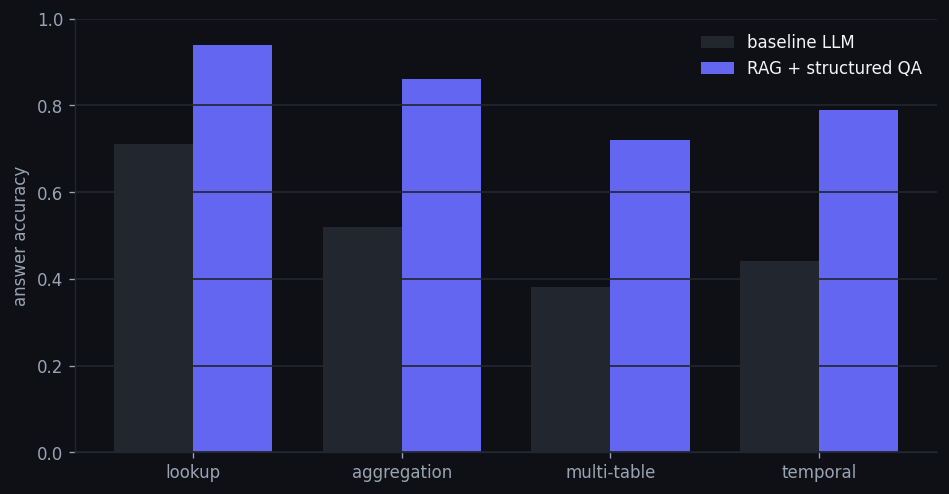

```{=html}
<section class="page-header">
  <div class="page-header-mesh m1"></div>
  <div class="page-header-mesh m2"></div>
  <p class="page-header-eyebrow">Selected work</p>
  <h1 class="page-header-title">Projects that <span class="grad-text">moved numbers.</span></h1>
  <p class="page-header-sub">
    Three projects, deep rather than wide. Best one first. Each page states
    the result in one line, then shows the work behind it — including what
    didn't work.
  </p>
</section>
```

<!-- Stacked, one per row — ordered same as each project's `order:` front matter.
     Update title/description here if you change a project's front matter. -->

::: {.reveal}
```{=html}
<div class="project-list">
  <a class="project-row" href="trade-promotion-forecasting/index.html">
    
    <div class="pr-body">
      <p class="pr-title">Saving a CPG client $2.4M on trade promotions</p>
      <p class="pr-sub">Sharper demand forecasts across an entire product portfolio cut wasted promotion spend and delivered $2.4M in client savings.</p>
    </div>
  </a>
  <a class="project-row" href="timeseries-anomaly-detection/index.html">
    
    <div class="pr-body">
      <p class="pr-title">Cutting alert fatigue 35% for an ops monitoring team</p>
      <p class="pr-sub">Redesigned anomaly detection to cut false alarms by 35%, restoring analysts' trust in the system without missing real incidents.</p>
    </div>
  </a>
  <a class="project-row" href="rag-nl2sql/index.html">
    
    <div class="pr-body">
      <p class="pr-title">Helping a CMO plan marketing spend with an LLM agent, not a dashboard</p>
      <p class="pr-sub">Built a RAG-powered marketing assistant that lets a CMO query existing data and plan activities in plain English — 2nd place in an internal build-off.</p>
    </div>
  </a>
</div>
```
:::
